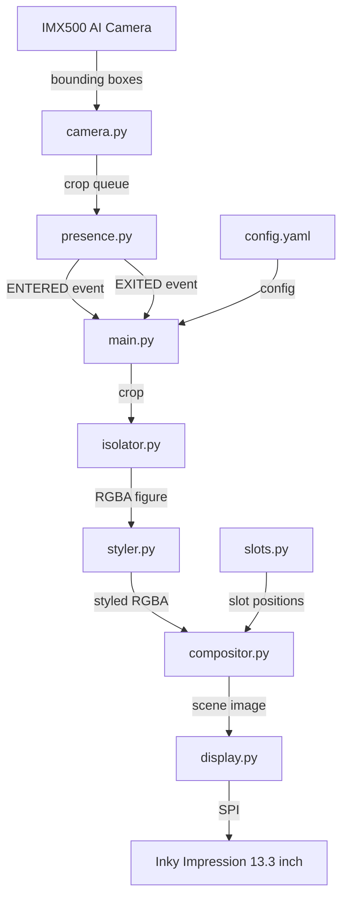
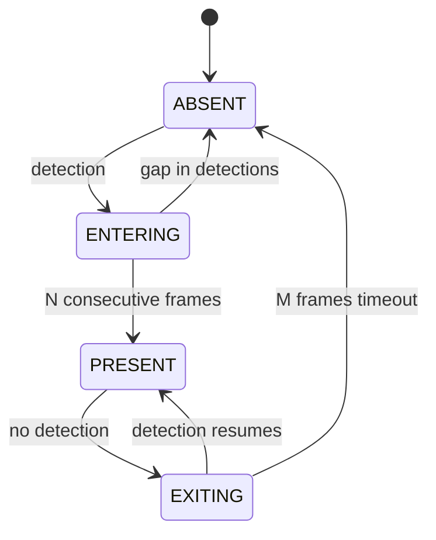

# Architecture — Van Gogh Living Scene

> Living document. Updated each sprint.

## System overview



## Module status

See `PROJECT_PLAN.md` for current module and sprint status.

## Data flow

1. **Camera** detects subjects via IMX500 NPU (on-sensor, zero CPU cost)
2. **Presence** state machine debounces detections into clean ENTERED/EXITED events
3. **Isolator** removes background from the crop using rembg (ONNX, CPU)
4. **Styler** applies Van Gogh brushstroke style via TFLite INT8 (CPU)
5. **Compositor** pastes the styled RGBA figure into a slot on the background
6. **Display** sends the composited scene to the Inky Impression e-ink panel

On ghost re-entry (subject returns within `ghost_ttl_seconds`), steps 3–4
are skipped and the cached styled image is composited directly.

## Memory layout (512 MB total)

```
Component                  Resident (approx)
─────────────────────────  ─────────────────
OS + Python runtime         ~80 MB
rembg session (persistent) ~300 MB
Background image (Pillow)   ~6 MB
TFLite transform (per-use) ~100 MB (freed after each subject)
─────────────────────────  ─────────────────
Peak during style transfer ~486 MB
```

The TFLite interpreter is created per-inference and explicitly destroyed
with `gc.collect()` to stay within the ~512 MB envelope. RSS is enforced
in the main event loop via `_check_rss()`, which logs current RSS at
DEBUG level and emits a WARNING + `ERROR_THRESHOLD_BREACH` security event
on the first breach of `memory.rss_warning_mb` (default 460 MB). The alert
auto-resets when RSS drops back below the threshold.

`_check_rss()` instrumentation points:

| Call site | Stage label |
|-----------|-------------|
| `Application.__init__` | After rembg session load |
| `Application.__init__` | After Styler init |
| `_handle_entered` | Before pipeline start (slot assigned) |
| `_handle_entered` | After isolation (rembg) |
| `_handle_entered` | After style transfer |
| `_handle_entered` | After compositing |
| `_watchdog_loop` | Each watchdog ping (every 120 s) |

## Sprint 2 — Camera and presence details

### Camera module (`camera.py`)

- `IMX500` is created **before** `Picamera2` to load `.rpk` firmware onto the NPU.
- Camera runs headless (`show_preview=False`) with `buffer_count=12`.
- Detection parsing reads three NPU output tensors: boxes, scores, class IDs.
- Bounding boxes are converted from inference coords to frame pixels via
  `imx500.convert_inference_coords()`.
- Valid detections (above confidence, matching allowed labels) are cropped and
  placed as `Detection(label, confidence, crop)` tuples onto a `queue.Queue`.
- Camera polling runs in a background thread via `run_loop()`.

### Presence state machine (`presence.py`)



- **Debounce**: `entering_frames` (default 8) consecutive detections to confirm
  entry. `exiting_frames` (default 30) consecutive misses to confirm exit.
- **Ghost cache (dual-system)**: Two caches work together to enable fast
  re-entry without re-running the expensive isolator and styler pipeline:
  - `_GhostCache` in `presence.py` — stores **raw crops** with a TTL
    (`ghost_ttl_seconds`, default 300 s). Continuously refreshed while the
    subject is PRESENT. On re-entry within TTL, the `ghost_hit` flag is set
    `True` in the event callback.
  - `_last_styled` in `main.py` — stores the **styled image** from the last
    full pipeline run. Retained across EXITED events. When `ghost_hit=True`,
    the styled image is reused directly, skipping isolator and styler
    entirely. Overwritten on the next full pipeline run when `ghost_hit=False`.
- **Event callback**: `ENTERED(crop, ghost_hit)` and `EXITED()` events are
  delivered to `main.py` via an `EventCallback` (type alias in `presence.py`).
- Presence ticks at 5 Hz (0.2 s interval), draining the detection queue each
  tick.

## Key design decisions

- **Lazy display init**: `display.py` defers hardware initialisation until
  first `show()` call, allowing all other modules to be tested without
  the Inky physically connected.
- **SlotManager owns assignment**: `compositor.py` receives a `Slot` object,
  not raw coordinates. This keeps slot state in one place.
- **Config-driven**: Every tuneable value lives in `config.yaml`. No magic
  numbers in source files.
- **No network at runtime**: All models are pre-downloaded by `install.sh`.
  The system runs fully offline.
- **Python 3.13 on aarch64**: All dependencies target Python 3.13 with
  pre-built ARM64 wheels. `tflite-runtime` replaced by `ai-edge-litert`
  (Google LiteRT, drop-in successor). `numpy` upgraded to 2.x.

## Security controls

This system follows a defence-in-depth approach appropriate for an offline
embedded IoT device. Full standards traceability is documented in
`SECURITY-POLICY.md`.

| Control | Description | Standard(s) |
|---------|-------------|-------------|
| Build-time integrity | SHA-256 checksums for model downloads; pip hash pinning | NIST SI-7, FIPS 140-3 |
| Config validation | All `config.yaml` values validated at startup for type, range, and path existence | OWASP A05, NIST CM-6 |
| Systemd sandboxing | Service runs as unprivileged user with `ProtectSystem=strict`, `NoNewPrivileges`, `MemoryDenyWriteExecute` | CIS L2, DISA-STIG |
| Input validation | Image pixel limits, JSON file size caps, magic byte checks, slot dimension validation | DISA-STIG, NIST SI-10 |
| Security audit logging | Dedicated security event logger for compliance-relevant events | OWASP A09, NIST AU-3 |
| Error resilience | Bounded error loops prevent resource exhaustion on hardware faults | DISA-STIG V-222659 |

## Sprint 3 — Isolator, styler, security logging, and tests

### Isolator module (`isolator.py`)

- Wraps rembg with a session created once at startup (passed in from `main.py`).
- Input: RGB PIL Image (subject crop). Output: RGBA PIL Image.
- Validates input dimensions (max 2048x2048) to prevent memory exhaustion.
- Logs RSS in debug mode. Calls `gc.collect()` after each removal.

### Styler module (`styler.py`)

- Two-stage Magenta TFLite pipeline via `ai-edge-litert` (Google LiteRT).
- **Stage 1 — predict**: Runs once at init. Loads the style image (Van Gogh
  painting), resizes to 256x256, computes a `(1, 1, 1, 100)` style bottleneck.
  Interpreter is immediately freed.
- **Stage 2 — transform**: Runs per subject. Creates a new interpreter, feeds
  the content image (384x384) and cached bottleneck, produces styled output.
  Interpreter is explicitly deleted with `gc.collect()` to reclaim ~100 MB.
- Alpha channel is separated before styling and re-applied after, so
  transparency from the isolator is preserved through the pipeline.
- RSS warning logged if peak exceeds the configured threshold (default 460 MB).

### Security audit logger (`security_log.py`, SEC-06)

- Enum-based event types matching SECURITY-POLICY.md event table.
- Each event has a default severity (CRITICAL, ERROR, WARNING).
- Structured log format includes timestamp, event type, and detail message.
- Outputs to StreamHandler (journald via systemd) and optional FileHandler.
- Initialisation is idempotent (safe to call multiple times).

### Test suite (`tests/`, SEC-07)

- 48 tests across 8 test files covering all Sprint 1–4 modules.
- Tests run without hardware (camera, display, models mocked or skipped).
- Covers: config validation, slot management, compositor magic bytes,
  camera error loop cap, isolator input limits, styler validation,
  security logger initialisation and event emission.

## Sprint 4 — Integration, service hardening, and final verification

### Main event loop (`main.py`)

- `Application` class owns all module lifecycles: config validation,
  security logger, slots, compositor, display, rembg session, styler,
  camera, and presence manager.
- Startup sequence: load config → validate → init security logger →
  init slots/compositor/display → create rembg session → init styler →
  start camera → start presence loop.
- Presence callback `_on_presence_event` dispatches ENTERED/EXITED events.
- **ENTERED (full pipeline)**: isolate (rembg) → style (TFLite) → composite
  → display. Intermediate images freed with `del` + `gc.collect()`. The
  styled result is cached in `_last_styled` for ghost re-entry.
- **ENTERED (ghost fast path)**: when `ghost_hit=True` and `_last_styled`
  exists, the isolator and styler are skipped entirely. The cached styled
  image is composited and displayed directly, saving 45–120 s of processing.
- **EXITED**: remove figure → release slot → re-render background → display.
  `_last_styled` is intentionally retained (TTL in presence gates reuse).
- **Error recovery**: if the pipeline raises an exception during ENTERED
  processing, the assigned slot is released and `_active_slot_id` is cleared
  so the slot can be reused. An `ERROR_THRESHOLD_BREACH` security event is
  emitted.
- Watchdog loop sends `WATCHDOG=1` to systemd every 120 s.
- Graceful shutdown on SIGTERM/SIGINT: stops presence, stops camera,
  joins threads with 5 s timeout.

### Systemd service (`vangogh_scene.service`, SEC-03)

Hardened per CIS L2 and DISA-STIG:

| Category | Directives |
|----------|-----------|
| Filesystem | `ProtectSystem=strict`, `ProtectHome=yes`, `PrivateTmp=yes`, `ReadOnlyPaths`, `ReadWritePaths=/var/log/vangogh` |
| Privileges | `NoNewPrivileges=yes`, `PrivateUsers=yes`, `RestrictSUIDSGID=yes` |
| Kernel | `ProtectKernelTunables/Modules/Logs=yes`, `ProtectControlGroups=yes` |
| Network | `PrivateNetwork=yes` (offline device) |
| Syscalls | `SystemCallArchitectures=native`, `@system-service` minus `@privileged @resources` |
| Devices | `DevicePolicy=closed` with explicit allows for video, SPI, GPIO, I2C |
| Resources | `MemoryMax=500M`, `MemoryHigh=460M`, `LimitCORE=0` |
| Restart | `Restart=on-failure`, `RestartSec=10`, `StartLimitBurst=5` in 300 s |
| Watchdog | `WatchdogSec=300` |

### Installer updates (`install.sh`)

- Creates `vangogh` system user with `nologin` shell.
- Sets directory ownership and `u=rwX,g=rX,o=` permissions.
- Adds `vangogh` to `video,spi,gpio,i2c` groups for hardware access.
- Installs and enables the systemd service.
- Configures journald `SystemMaxUse=50M` to prevent SD card fill (RG-07).

### Integration test suite (`tests/test_integration.py`)

- 7 tests covering the full pipeline with mocked hardware.
- `TestEnteredPipeline`: ENTERED event triggers composite + display update.
- `TestExitedClears`: EXITED removes figure and refreshes display.
- `TestPresenceIntegration`: full enter/exit cycle and cancelled exit.
- `TestSecurityLoggerIntegration`: logger writes to file in context.
- `TestConfigValidationIntegration`: validator passes with real paths.
